# 🛒 Supermarket ERP System (MVP)

After more than **four months of continuous work**, this project represents the **MVP version of a full ERP system for a supermarket**.  
The system was built by leveraging my academic background in **Management Information Systems (MIS)**, combining **administrative, financial, and technical perspectives** into one integrated solution.

The current version focuses on **MIS (Management Information System)** functionalities.  
The **AIS (Accounting Information System)** layer is planned for future iterations.

---

## 🎯 Project Overview

This ERP system aims to **automate all supermarket operations** by integrating multiple business units into a single centralized system, backed by a unified database.  
The primary goal is to **support management decision-making** through accurate, real-time, and reliable data.

---

## 🛠️ Technologies & Tools

- **Programming Language:** C#
- **Framework:** WinForms
- **Database:** SQL Server
- **Query Language:** T-SQL
- **Data Access:** ADO.NET
- **Architecture:** Three-Tier Architecture + DTO Layer
- **Reporting:** RDLC

---

## 🧠 Technical Highlights

- **Codebase Size:**  
  More than **45,000 lines of code** (C# & T-SQL), written with best practices and clean code principles.

- **Database Design:**  
  - ~50 tables (MVP actively uses 35+ tables)
  - 130+ Stored Procedures
  - 13 Views
  - Multiple Functions and User-Defined Types

- **User Interface:**  
  - Interactive WinForms UI  
  - Focus on usability (UX) and data-entry efficiency  
  - Master–Detail UI pattern for list-based screens

- **Software Engineering Principles:**  
  - SRP (Single Responsibility Principle)  
  - DRY (Don’t Repeat Yourself)  
  - Separation of Concerns (SoC)

- **Design Patterns Applied:**  
  - Observer  
  - Factory  
  - Singleton  
  - Service Layer Pattern  
  - Rich Domain Model  
  - Dependency Inversion

- **Validation System:**  
  - Custom validation framework  
  - Validation enforced at:
    - UI Layer
    - Business Logic Layer
    - Database Layer (Stored Procedures & Triggers)

- **Additional Technical Features:**  
  - Eager & Lazy Loading (context-based)
  - Immutable Data Types for critical entities
  - Windows Registry usage for application-level settings
  - Centralized Event Viewer for logging runtime exceptions

---

## 🚧 Key Challenges

### 1️⃣ Handling Edge Cases
One of the biggest challenges was dealing with **complex edge cases**, where solving one scenario often revealed multiple new ones.  
Through careful analysis and iterative refinement, all critical scenarios were handled, making the system **robust and production-ready**, not just a demo project.

### 2️⃣ Generic Base Form Architecture
To unify the behavior of all list-based screens:
- A **Generic Base Form** was implemented
- Transitioned from **Active Record** to **Service Layer Pattern**
- Applied **Generics & Interfaces** to enable manual Dependency Injection (DI)

This resulted in:
- Centralized handling of search, filtering, deletion, and activation logic
- Easy addition of new list screens
- Event-based updates for real-time UI refresh (Loose Coupling)
- A consistent user experience across the system

---

## 📦 System Scope & Core Modules

### 📦 Advanced Inventory & Warehouse Management (Core Module)
- Three-dimensional inventory tracking: **(Product – Unit – Warehouse)**
- Multiple warehouses:
  - Store Warehouse (fixed, non-editable)
  - Main Warehouse
  - Sub-Warehouses
- Strict and auditable **stock transfer logic**
- Stock Movement system logging every inbound/outbound operation
- Dedicated screens for:
  - Inventory movements
  - Transfer operations and details
- Support for **alternative units**, enabling flexible purchasing, stocking, and selling

### 🏷️ Dynamic Discounts & Tax System
- Discounts linked to **Product + Unit**
- Tax system linked to **Product level**
- Ensures accurate pricing and financial compliance

### 🤝 Suppliers & Purchasing
- Full supplier management
- Complete purchase cycle with purchase returns
- Real-time inventory updates

### 💰 Sales & Financial Operations
- Sales invoices and sales returns
- Payments & Receipts module
- Tracks cash flow within an administrative (non-accounting) context

### 📊 Reporting System
- Analytical reports generated from the centralized database
- Represents the **true value** of integrating all system modules

---

## 🖼️ Screenshots (Placeholders)

### Dashboard / Quick Overview
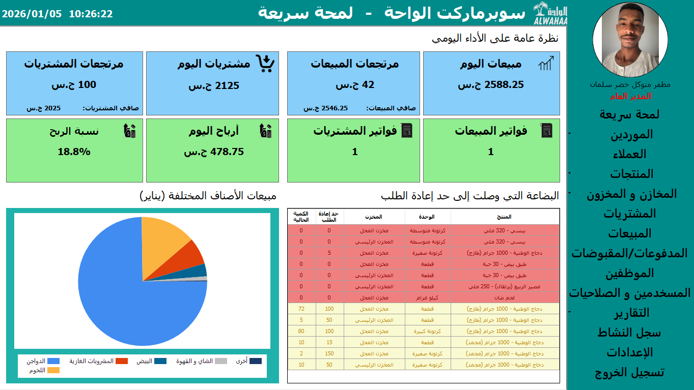

### Products Management
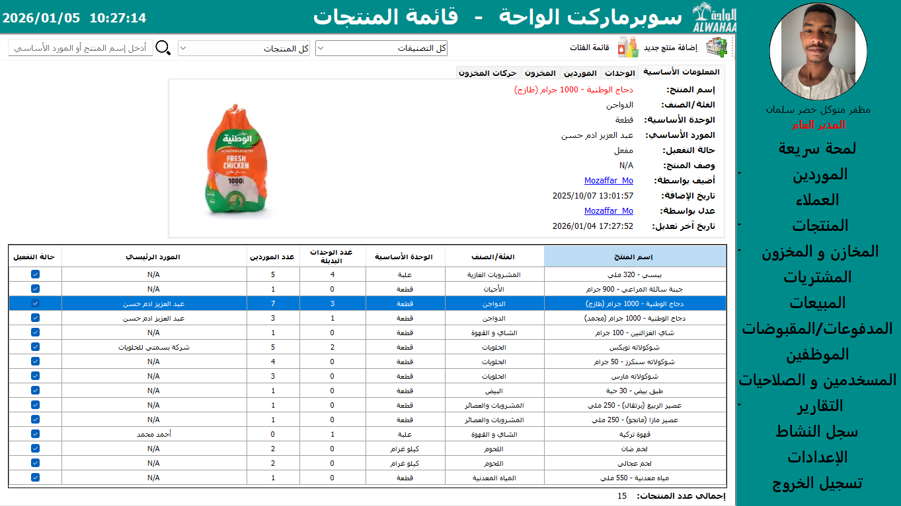

### Suppliers Management
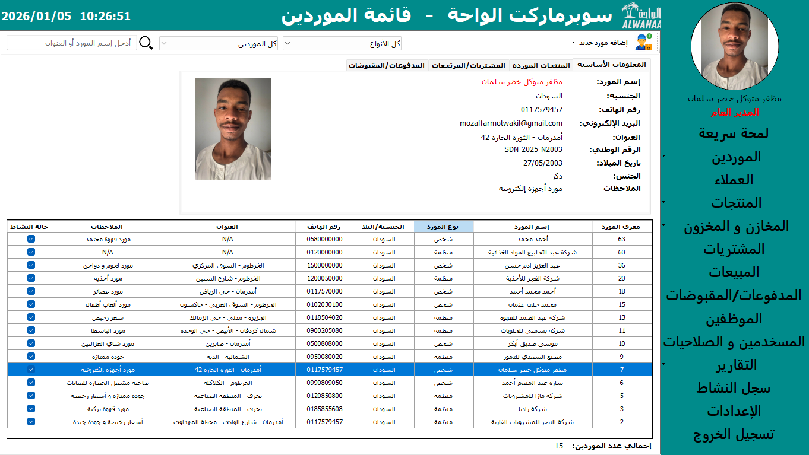

### Inventory Overview
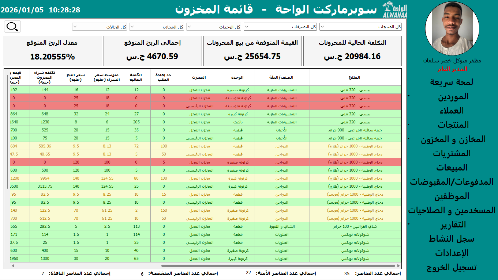

### Stock Movements
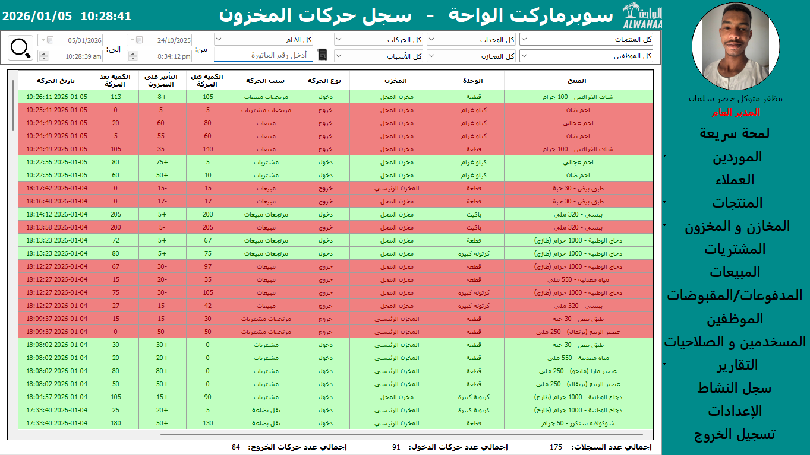

### Stock Transfers
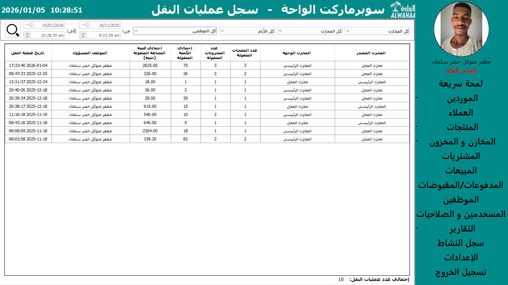

### Purchase Invoices

### Sales Invoices
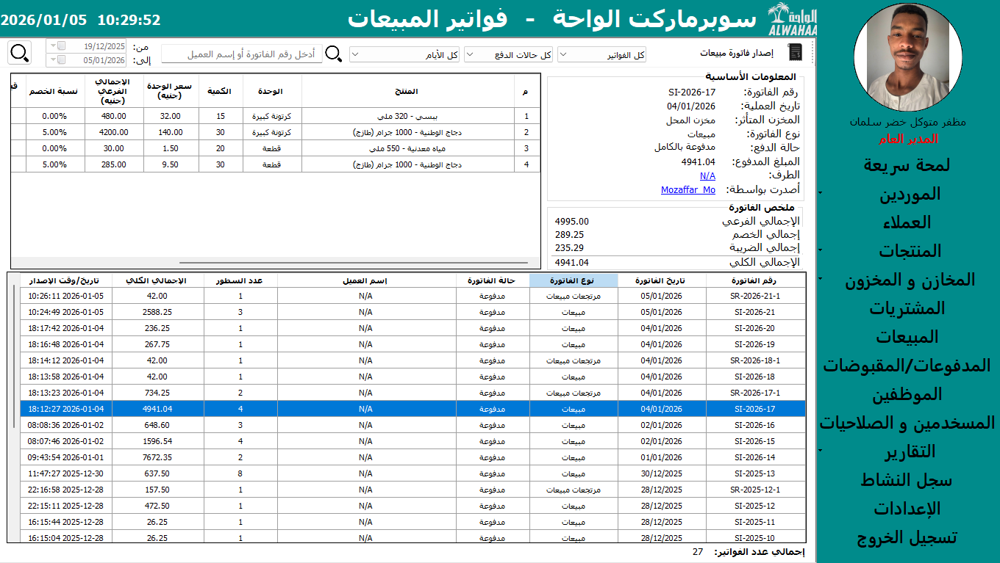

### Payments & Receipts
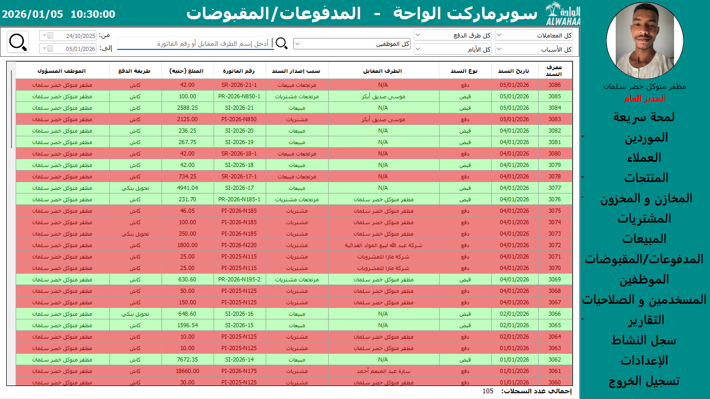

### Sales Report (Comprehensive)
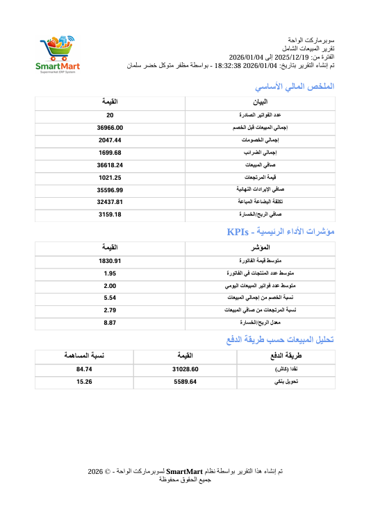

### Purchases Report (Comprehensive)
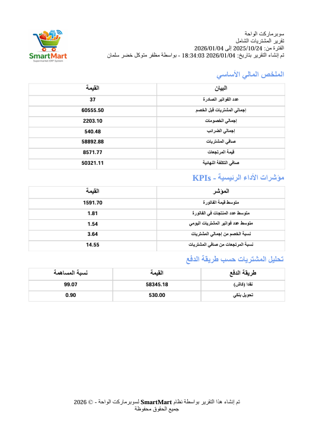

### Database Schema
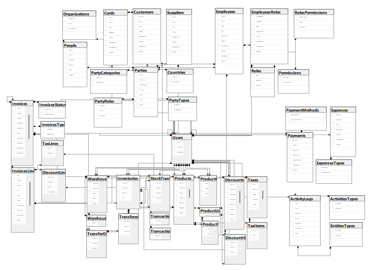

---

## 📌 Notes

- This project was built **entirely solo**, covering analysis, design, development, testing, and refinement.
- The MVP focuses on **operational integrity and data accuracy**.
- Future iterations may include:
  - Full AIS implementation
  - Role-based security & permissions
  - Web-based interface

---

## 🔖 Tags
`#ERP` `#MIS` `#CSharp` `#WinForms` `#SQLServer` `#ADO.NET` `#SoftwareArchitecture` `#ProgrammingAdvices`
